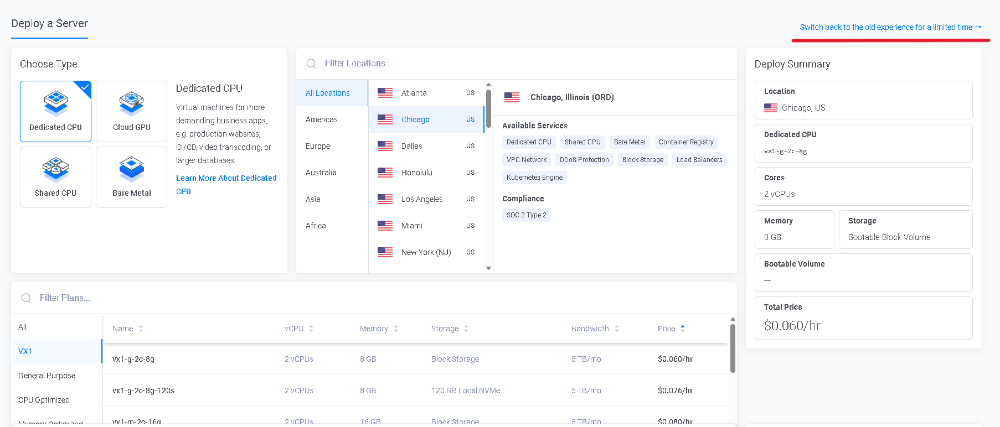
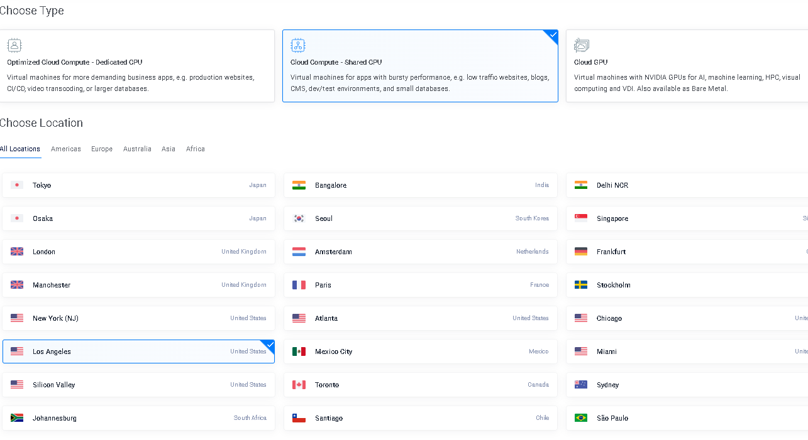
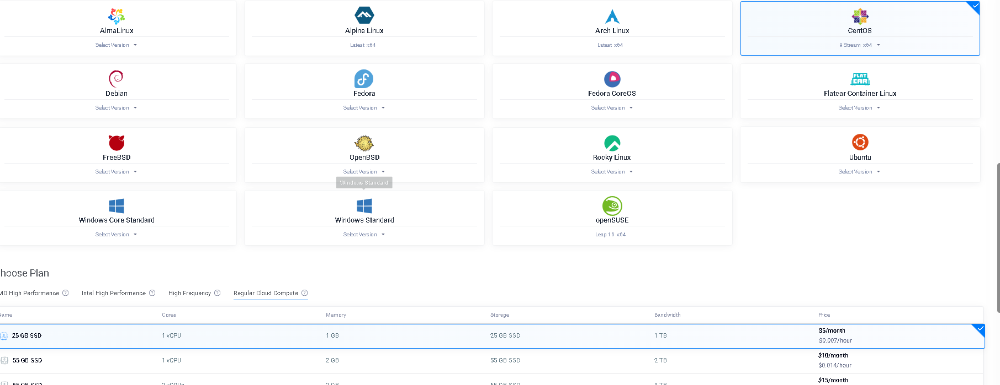
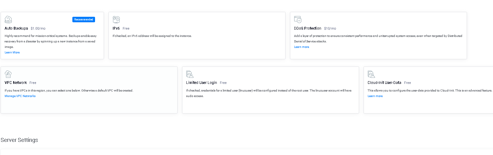
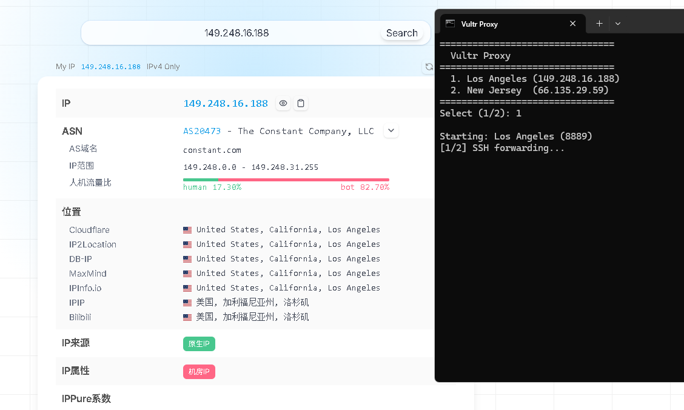

# Vultr VPS SSH 代理配置指南

通过 Vultr VPS + SSH 端口转发 + Tinyproxy HTTP 代理搭建，适用于 Windows，浏览器无需安装插件。

## 为什么用 HTTP 代理而非 SOCKS5？

SOCKS5 下浏览器在本地解析 DNS，国内 DNS 污染导致解析到错误 IP，部分网站无法访问。HTTP 代理的 DNS 在服务器端完成，彻底解决此问题。详见第十二节原理说明。

---

## 准备

- 一台 Vultr VPS（本文以 CentOS / Ubuntu 为例）
- 本地 Windows 10/11（自带 OpenSSH 客户端）

---

## 〇、购买 Vultr 服务器（新手必看）

若已有服务器可跳过。以下为 CentOS Stream 最低配（$6/月）的购买流程。

### 1. 切换到旧版控制台

Vultr 新版界面较复杂，建议切回旧版：点击右上角头像 → **Back to Classic View**。



### 2. 选择服务器类型

**Cloud Compute** → **AMD High Performance** 或 **Intel Regular Performance**，均选择 **Shared CPU** 即可，价格最低。



### 3. 选择系统和配置

- **Server Location**：选洛杉矶（Los Angeles）—— 国内延迟最低
- **Operating System**：CentOS Stream 或 Ubuntu
- **Server Size**：**$6/月 最低配足够**（1 vCPU / 1GB RAM / 25GB SSD / 2TB 流量）



### 4. 取消额外服务（省钱）

**全部取消勾选**：自动备份、IPv6 等不需要，省下额外费用。



### 5. Deploy Now

确认后点击 **Deploy Now**，等待 2-3 分钟服务器就绪。Vultr 会显示 IP 和 root 密码。

> **月费 $6，约合人民币 43 元。** 按以下步骤配好之后，这就是你自己的专属代理。

正式使用时建议加入 SSH 密钥代替密码登录（见第一节）。

---


## 一、生成 SSH 密钥

在 PowerShell 中执行：

```powershell
ssh-keygen -t ed25519 -f "$env:USERPROFILE\.ssh\id_ed25519_vultr" -N '""'
```

生成后得到两个文件：
- 私钥：`~/.ssh/id_ed25519_vultr`（保密，切勿泄露）
- 公钥：`~/.ssh/id_ed25519_vultr.pub`（上传到服务器）

---

## 二、上传公钥到服务器

**方式 A — Vultr 网页控制台**

1. 登录 [Vultr](https://my.vultr.com/) → 找到服务器 → View Console
2. 用 root 登录后执行：

```bash
mkdir -p ~/.ssh && echo '粘贴你的公钥内容' >> ~/.ssh/authorized_keys && chmod 600 ~/.ssh/authorized_keys
```

**方式 B — 本地 ssh-copy-id**

```powershell
ssh-copy-id -i "$env:USERPROFILE\.ssh\id_ed25519_vultr.pub" root@<你的服务器IP>
```

---

## 三、服务器端安装 Tinyproxy

SSH 登录服务器后执行：

**CentOS / Rocky Linux：**
```bash
dnf install -y tinyproxy
echo 'Allow 127.0.0.1' >> /etc/tinyproxy/tinyproxy.conf
systemctl enable --now tinyproxy
systemctl status tinyproxy  # 确认 running
```

**Ubuntu / Debian：**
```bash
apt update && apt install -y tinyproxy
echo 'Allow 127.0.0.1' >> /etc/tinyproxy/tinyproxy.conf
systemctl enable --now tinyproxy
systemctl status tinyproxy  # 确认 running
```

> Tinyproxy 默认监听 8888 端口，仅允许来自 127.0.0.1 的连接（只通过 SSH 隧道访问，不暴露公网）。

---

## 四、配置 SSH 别名

编辑 `~/.ssh/config`，添加：

```
Host vultr
    HostName <你的服务器IP>
    User root
    Port 22
    IdentityFile ~/.ssh/id_ed25519_vultr
```

多台服务器时使用不同的 Host 别名：

```
Host vultr-la
    HostName 149.248.16.188
    User root
    Port 22
    IdentityFile ~/.ssh/id_ed25519_vultr

Host vultr-nj
    HostName 66.135.29.59
    User root
    Port 22
    IdentityFile ~/.ssh/id_ed25519_vultr
```

测试免密登录：

```powershell
ssh vultr echo "OK"
```

---

## 五、创建代理脚本

在同一目录下创建以下两个文件（如 `D:\proxy\`）。

### vultr-proxy.bat

```batch
@echo off
title Vultr Proxy
setlocal enabledelayedexpansion

echo ================================
echo   Vultr Proxy
echo ================================
echo   1. Los Angeles (149.248.16.188)
echo   2. New Jersey  (66.135.29.59)
echo ================================
set /p choice="Select (1/2): "

REM 每台服务器分配不同本地端口，可同时开启
if "%choice%"=="1" (
    set HOST=vultr-la
    set PORT=8889
    set LABEL=Los Angeles
)
if "%choice%"=="2" (
    set HOST=vultr-nj
    set PORT=8890
    set LABEL=New Jersey
)
if not defined HOST (
    echo Invalid choice.
    pause
    exit /b
)

echo.
echo Starting: !LABEL! on port !PORT!

REM ── 第1步：SSH 端口转发（服务器 8888 → 本地 !PORT!） ──
echo [1/2] SSH forwarding...
"C:\windows\System32\OpenSSH\ssh.exe" -f -L !PORT!:127.0.0.1:8888 -N -o ExitOnForwardFailure=yes !HOST!

if errorlevel 1 (
    echo ERROR: SSH connection failed.
    pause
    exit /b
)

REM ── 第2步：生成并执行 proxy-on.ps1（设置系统代理） ──
echo [2/2] Enabling system proxy...
(
echo $key  = 'HKCU:\Software\Microsoft\Windows\CurrentVersion\Internet Settings'
echo Set-ItemProperty -Path $key -Name ProxyServer -Value 'http=127.0.0.1:!PORT!;https=127.0.0.1:!PORT!'
echo Set-ItemProperty -Path $key -Name ProxyEnable -Value 1
echo Write-Host 'Proxy ON: http://127.0.0.1:!PORT!'
) > "%TEMP%\proxy-on.ps1"

powershell -ExecutionPolicy Bypass -File "%TEMP%\proxy-on.ps1"
del "%TEMP%\proxy-on.ps1" 2>/dev/null

echo.
echo ================================
echo   !LABEL! proxy is ON
echo   127.0.0.1:!PORT!
echo   Press any key to DISABLE
echo ================================
pause >/dev/null

REM ── 清理 ──
echo Disabling proxy...
(
echo $key = 'HKCU:\Software\Microsoft\Windows\CurrentVersion\Internet Settings'
echo Set-ItemProperty -Path $key -Name ProxyEnable -Value 0
echo Write-Host 'Proxy OFF'
) > "%TEMP%\proxy-off.ps1"

powershell -ExecutionPolicy Bypass -File "%TEMP%\proxy-off.ps1"
del "%TEMP%\proxy-off.ps1" 2>/dev/null

taskkill /F /IM ssh.exe 2>/dev/null
echo Done.
pause
```

### vultr-proxy-off.bat（强制关闭）

如果直接点 X 关闭窗口导致代理没关，双击此脚本一键清理：

```batch
@echo off
echo Turning off proxy and killing SSH tunnels...
(
echo $key = 'HKCU:SoftwareMicrosoftWindowsCurrentVersionInternet Settings'
echo Set-ItemProperty -Path $key -Name ProxyEnable -Value 0
echo Write-Host 'Proxy OFF'
) ^> "%TEMP%proxy-off.ps1"
powershell -ExecutionPolicy Bypass -File "%TEMP%proxy-off.ps1"
del "%TEMP%proxy-off.ps1" 2^>nul
taskkill /F /IM ssh.exe 2^>nul
echo Done.
pause
```

---


### 脚本逐段说明

| 步骤 | 做什么 | 关键命令 |
|------|--------|---------|
| 选服务器 | 选择 Host 别名和本地端口 | `set HOST` / `set PORT` |
| SSH 转发 | 加密隧道：本地端口 → 服务器 8888 | `ssh -f -L !PORT!:127.0.0.1:8888 -N !HOST!` |
| 系统代理 | 写入注册表，浏览器流量导向本地端口 | `Set-ItemProperty ... ProxyServer 'http=...;https=...'` |
| 等待 | 窗口保持打开，代理持续生效 | `pause` |
| 关闭 | 关代理 → 杀 SSH → 退出 | `ProxyEnable=0` / `taskkill` |

> **设计要点：** PowerShell 命令通过 bat 动态生成 `.ps1` 文件再执行，避免了中文 Windows 下 cmd → PowerShell 传参时的编码乱码问题。

---

## 六、使用

1. 双击 `vultr-proxy.bat`
2. 输入 `1`（洛杉矶）或 `2`（新泽西）
3. 窗口保持打开，打开浏览器即可访问
4. 按任意键 → 自动关闭代理并断开隧道

> Edge / Chrome 均支持，通过 Windows 系统代理驱动，无需插件。

---

### 代理生效验证

连接成功后打开 https://ipinfo.io，IP 变为 Vultr 服务器地址即表示代理生效：



---

## 七、数据流

```
浏览器 ──HTTP──▶ 本地:8889 ──SSH加密──▶ Vultr ──HTTP──▶ Tinyproxy:8888 ──▶ 互联网
     (系统代理)          (ssh -L)       (VPS)             (DNS解析)
```

| 环节 | 作用 | 安全性 |
|------|------|--------|
| Windows 系统代理 | 浏览器流量导向本地端口 | 本机内部，无需加密 |
| SSH 端口转发 (`-L`) | 加密传输本地 → 服务器 | SSH 加密，防窃听 |
| Tinyproxy | 服务器端 HTTP 代理 + DNS 解析 | 仅监听 127.0.0.1 |

---

## 八、故障排查

| 问题 | 检查命令 |
|------|---------|
| bat 双击闪退 | bat 文件行尾需为 CRLF（`
`），用 Notepad++ 或 `unix2dos` 转换 |

| 页面打不开 | `vultr-proxy.bat` 窗口是否开着 |
| 端口不通 | `netstat -ano \| findstr "888."` 确认转发在监听 |
| 服务器不通 | `ssh vultr-la echo ok` 测试 SSH |
| Tinyproxy 挂了 | 服务器执行 `systemctl status tinyproxy` |
| 代理未生效 | PowerShell 执行 `Get-ItemProperty 'HKCU:\Software\Microsoft\Windows\CurrentVersion\Internet Settings' \| Select ProxyEnable, ProxyServer` |
| 代理测速 | 服务器执行 `curl -x http://127.0.0.1:8888 https://www.google.com -o /dev/null -w '%{time_total}s %{http_code}'` |

---

## 九、WebRTC 泄露风险与防护

### 什么是 WebRTC 泄露

WebRTC 是浏览器内嵌的点对点实时通信协议，用于 Google Meet、Zoom Web 版等应用。它为了建立直连，会通过 STUN 协议向外部服务器查询你的公网 IP，**这个查询不走系统代理**。

```
浏览器主流量 ──▶ 系统代理 ──▶ SSH 隧道 ──▶ Vultr ──▶ 目标网站  ← IP: 149.248.16.188 ✓
WebRTC STUN ──▶ 直接出网 ──▶ Google STUN 服务器              ← IP: 49.77.x.x ✗ 泄露!
```

### 检测是否泄露

代理连接状态下打开 https://ipleak.net，往下滚动到 **"WebRTC Leak Test"** 区域：

- 看到 `Public IP Address: 49.77.x.x` → **正在泄露**
- 看到 `n/a` 或空白 → 安全

### 修复方法

**方法一：安装 WebRTC Leak Prevent 扩展（推荐）**

Chrome / Edge 均适用：

1. 打开 https://chromewebstore.google.com/detail/webrtc-leak-prevent/eiadekoaikejlgdbkbdfeijglgfdalml
2. 添加到浏览器
3. 点击扩展图标 → 选择 **Disable WebRTC**
4. 刷新 ipleak.net 确认不再显示真实 IP

**方法二：浏览器设置（Edge）**

地址栏输入 `edge://flags/#enable-webrtc-hide-local-ips-with-mdns`，改为 **Disabled**。

**方法三：Chrome WebRTC 策略**

地址栏输入 `chrome://settings/content/webrtc`，关闭 WebRTC。

> **推荐方法一**，一键开关，随时控制。官方仓库：[aghorler/WebRTC-Leak-Prevent](https://github.com/aghorler/WebRTC-Leak-Prevent)

---

## 十、安全建议

- 禁用密码登录：`/etc/ssh/sshd_config` → `PasswordAuthentication no` → `systemctl reload sshd`
- Tinyproxy 只监听 127.0.0.1，公网无法直连
- 定期更新：`dnf update -y`（CentOS）或 `apt update && apt upgrade -y`（Ubuntu）
- 可配置 `ufw` / `firewalld` 限制入站端口

---

## 十一、实测数据

### 洛杉矶节点（建议默认使用）

| 网站 | 状态 | 加载时间 |
|------|------|---------|
| Google | OK | ~3.5s |
| YouTube | OK | ~3.5s |
| Twitter | OK | ~10s |
| Instagram | OK | ~3.5s |
| GitHub | OK | ~12s |
| Wikipedia | OK | ~4s |
| Netflix | OK | ~5.7s |
| Twitch | OK | ~4.5s |
| TikTok | OK | ~8.3s |
| ChatGPT / Reddit / OpenAI | OK（浏览器） | Cloudflare JS 验证 |

> curl 访问 Cloudflare 站点返回 403，浏览器有 JS 引擎可正常通过。

### 两节点对比

| 指标 | 洛杉矶 (LA) | 新泽西 (NJ) |
|------|-----------|-----------|
| 延迟 | 187ms | 257ms |
| Google | 3.5s | 5.6s |
| YouTube | 3.5s | 9.3s |
| Twitter | 10s | 26s |
| Instagram | 3.5s | 11s |
| GitHub | 12s | 12s |
| Netflix | 5.7s | 21s |

> **结论：洛杉矶全面领先，建议只保留 LA 节点。**

---

## 十二、代理原理

### HTTP 代理工作方式

**普通 HTTP 请求：**

```
浏览器 ──GET / HTTP/1.1──▶ 代理 ──GET / HTTP/1.1──▶ 目标网站
```

浏览器说"我要访问 A"，代理替你去请求，DNS 在代理端解析。

**HTTPS 请求（HTTP CONNECT 隧道）：**

```
浏览器 ──CONNECT google.com:443──▶ 代理 ──TCP──▶ google.com:443
        ◀── 200 OK ──────────────         │
        ════ TLS 加密直通 ════════════════
```

代理收到 `CONNECT` 后仅建立 TCP 隧道，不解密 TLS，安全性不变。DNS 依然在代理端解析。

### 四种代理对比

| 类型 | 层级 | DNS 解析 | 加密 | 适用 |
|------|------|---------|------|------|
| HTTP 代理 | 应用层 | **服务器端** | 无 | 浏览器 |
| HTTPS 代理 | 应用层 | **服务器端** | 有（到代理） | 浏览器 |
| SOCKS5 | 传输层 | 本地 | 无 | 任意 TCP |
| VPN | 网络层 | **服务器端** | 有 | 全设备 |

> SOCKS5 最大问题是 DNS 在本地解析，国内环境效果大打折扣。

---

## 参考项目

- [Tinyproxy](https://github.com/tinyproxy/tinyproxy) — 轻量级 HTTP 代理，本项目服务器端核心
- [buildVpn](https://github.com/yukaiji/buildVpn) — Vultr 代理方案参考
